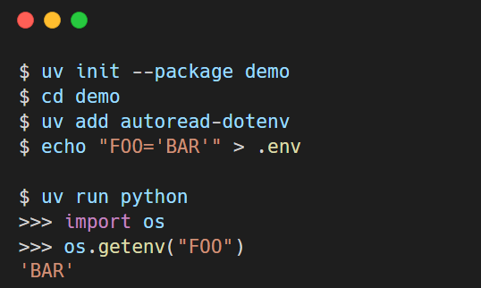

# autoread-dotenv

[](https://github.com/libranet/autoread-dotenv/actions/workflows/testing.yaml)
[](https://github.com/libranet/autoread-dotenv/actions/workflows/linting.yaml)
[](https://autoread-dotenv.readthedocs.io/en/latest/)
[](https://codecov.io/gh/libranet/autoread-dotenv)
[](https://pypi.org/project/autoread-dotenv/)
[](https://github.com/libranet/autoread-dotenv/blob/main/docs/license.md)

autoread-dotenv parses your `.env` file when starting any venv-based Python process:



## Installation

Install with uv (preferred):

```bash
> uv add autoread-dotenv
```

If you are using Poetry:

```bash
> poetry add autoread-dotenv
```

Install via pip:

```bash
> bin/pip install autoread-dotenv
```

## Set up a local development environment

```bash
> just install
```

## Usage

The only thing left to do for you is the create a `.env` in the root of your project.

## Registered sitecustomize-entrypoint

The `autoread_dotenv.entrypoint`-function is registered as a `sitecustomize`-entrypoint in our pyproject.toml\_:

```toml

    [project.entry-points.sitecustomize]
    autoread_dotenv = "autoread_dotenv:entrypoint"
```

Sitecustomize and all its registered entrypoints will be executed at the start of *every* python-process.
For more information, please see [sitecustomize-entrypoints](http://pypi.python.org/pypi/sitecustomize-entrypoints)

## Avoid overriding existing environments variables

By default, your .env-file read by `autoread-dotenv` will override any pre-existing environment variables.
You can avoid this behaviour by setting `AUTOREAD_ENFORCE_DOTENV=0`.

## Overriding where the .env-file is looked up

By default, `autoread-dotenv` locates your `.env` relative to `sys.prefix`, assuming the
in-project-virtualenv layout described above. For setups that don't follow that convention
(global installs, containers, editable mounts, ...), set `AUTOREAD_DOTENV_PATH` to the full path
of the `.env`-file to use instead - it takes precedence and skips the `sys.prefix`-based lookup
entirely:

```bash
> export AUTOREAD_DOTENV_PATH=/etc/myapp/production.env
```

## Performance

`autoread-dotenv` runs on the start of every Python process in the venv, so its startup-time
cost is measured and tracked explicitly - see [docs/performance.md](performance.md) for the
current numbers and how to reproduce them.

## Compatibility

[](https://pypi.org/project/autoread-dotenv/)
[](https://pypi.org/project/autoread-dotenv/)

`autoread-dotenv` works on Python 3.9+, including PyPy3. Tested until Python 3.14.

## Notable dependencies

- [sitecustomize-entrypoints](http://pypi.python.org/pypi/sitecustomize-entrypoints)
- [python-dotenv](http://pypi.python.org/pypi/python-dotenv)
